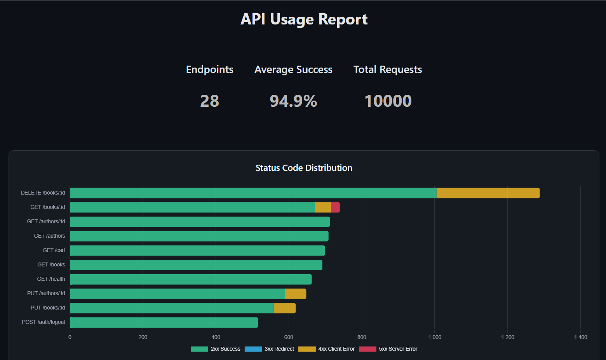
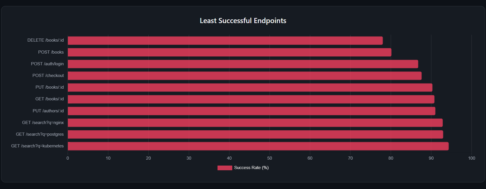
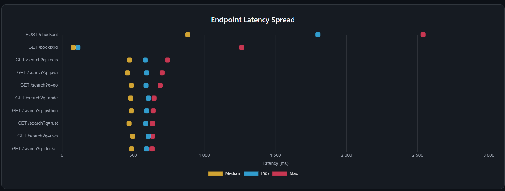

# Endpoint Analyzer

A fast CLI tool that parses JSON-formatted API logs and generates an HTML dashboard.

The report includes an overall summary, status code distribution, endpoint health, and latency metrics (Median, P95, and Max).

## Usage

### 1. Prepare a log file

Create a JSONL file (for example, `logs.jsonl`) where each line contains a single log entry:

```json
{"method":"DELETE","path":"/books/675","status":404,"duration":191}
{"method":"GET","path":"/health","status":200,"duration":16}
{"method":"POST","path":"/auth/login","status":200,"duration":284}
```

### 2. Run the analyzer

```bash
npx endpoint-analyzer logs.jsonl
```

You can also specify how many endpoints should be included in each chart. The range is **3 to 10**.

For example:

```bash
npx endpoint-analyzer logs.jsonl 3 5 10
```

### 3. View the report

The generated HTML report is saved in the `reports` directory.

## Features

- **Status Code Distribution**  
  Stacked bar charts showing the distribution of 2xx, 3xx, 4xx, and 5xx responses.

- **Endpoint Success Rate**  
  Highlights the least successful endpoints based on their success rate.

- **Latency Visualization**  
  Displays Median, P95, and Maximum latency for each endpoint.

## Screenshots







## Installation

Install the package globally:

```bash
npm install -g endpoint-analyzer
```